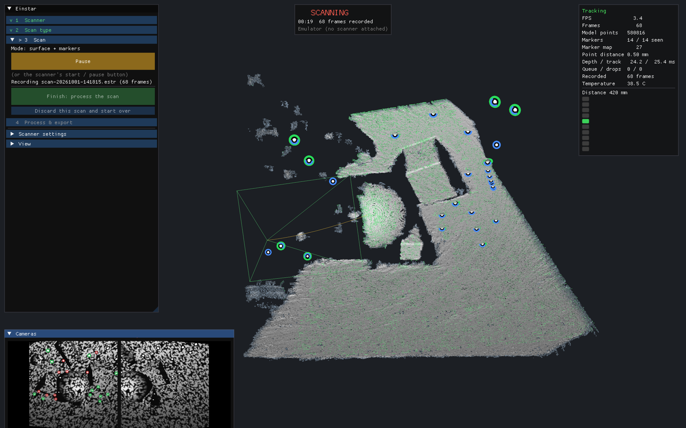
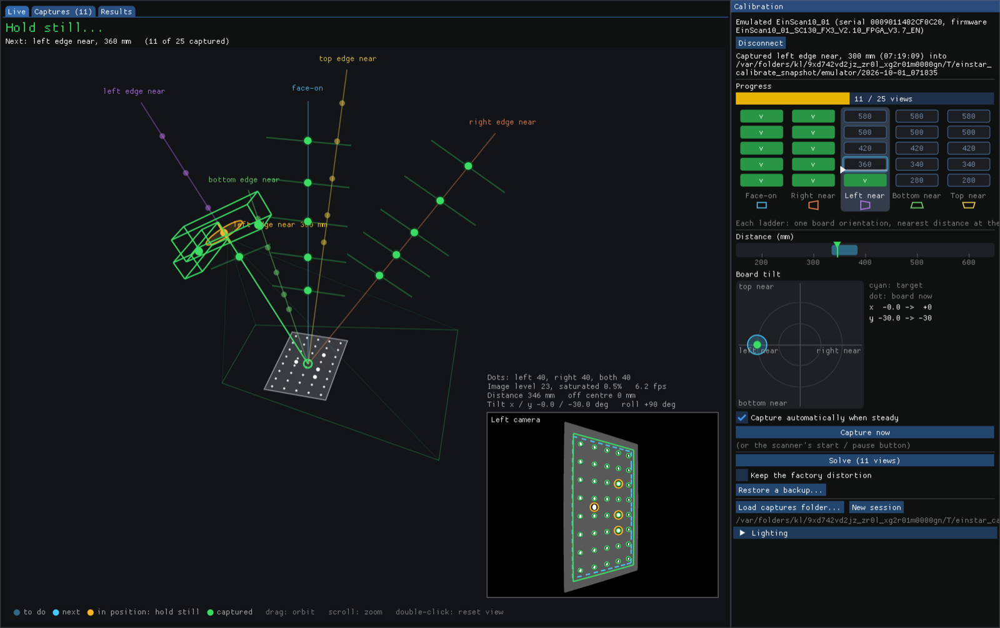
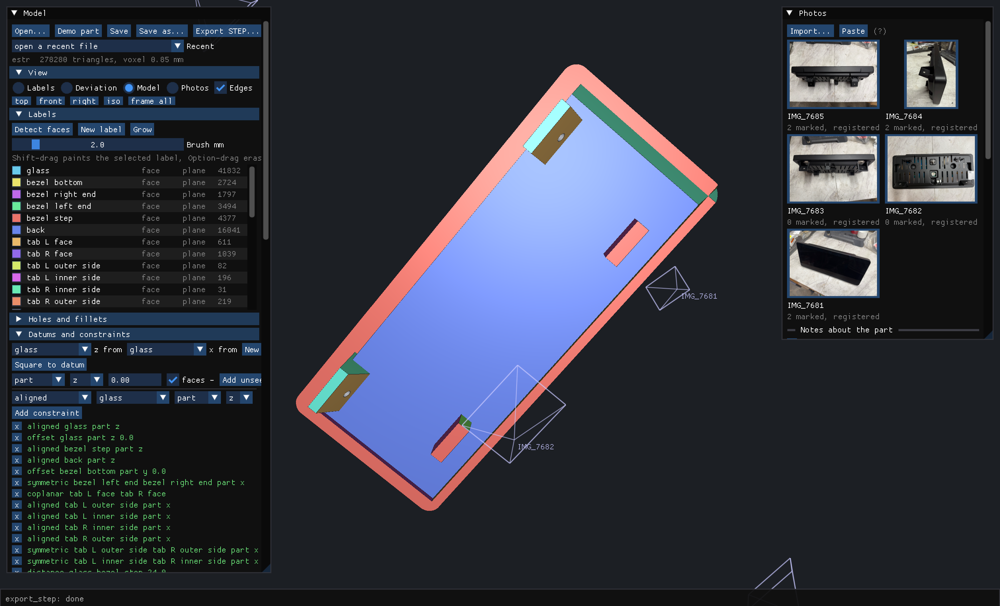

# einstar

Open-source software for the Einstar handheld 3D scanner, covering both ends of the USB cable: the computer
side (live scanning, processing to a mesh, calibration) and the scanner's own firmware. C++23 on macOS with
Metal; the device layer uses libusb.

Runs on Apple Silicon Macs (developed on an Apple Silicon MacBook Pro) and on Intel Macs with a discrete GPU:
it also runs live on a 2019 Intel iMac (6-core Core i5, Radeon Pro GPU) with the scanner on USB 2.0. The GPU
code adapts to both, using unified memory on Apple Silicon and managed buffers and GPU-specific kernel
variants on discrete GPUs.

## Apps

### Einstar: scanning



`build/apps/Einstar.app`
- **Guided workflow:** connect the scanner → choose the scan type → (capture global markers) → scan → process
  and export. A banner over the 3D view always shows the state: not connected, offline, capturing markers,
  scanning or tracking lost, paused, processing.
- **Scan types:** surface + markers, surface only, or global markers first. Global markers are a marker
  constellation captured and bundle-adjusted before the surface scan, so the whole object shares one
  drift-free frame. The map is stored in every scan and can be reused from an earlier one.
- **Live scanning:** stereo depth from the IR pair on the GPU, tracking on geometry and markers with
  relocalisation after a loss, a live fused model, camera previews with marker detections (upright, as the
  scanner is held: the cameras sit along its length), and the scanner's pose and path.
- **3D view:** surface seen from behind (the inside of the object) is drawn in a muted red-brown, for the live
  points as for the processed mesh. Left-drag orbits freely, right-drag pans, the wheel zooms, a double-click
  resets the view. The scanner is shown as a low-poly model at its live pose. "Follow scanner" (View) keeps
  the camera behind and above the scanner, upright as it is held, looking where it points over its top (so
  the scanner stays low in the view, clear of the scan); orbiting or panning leaves it.
- **Editing a paused scan:** Shift-drag a lasso to select (Option-drag deselects) -- everything inside it,
  front to back -- and Delete removes it from the live model and from the recording, so processing never
  sees it; Cmd+Z undoes until you resume. Rescanning a deleted area brings it back.
- **Scanner controls:** the start / pause and brightness buttons, the top LED as a distance indicator, and
  exposure, gain, projector and strobe settings.
- **Recording:** every scan is saved to `~/Documents/Einstar/Scans/*.estr`: depth, poses, markers, the
  calibration and capture settings, optionally the raw IR images. *Open a recorded scan...* brings one back
  as a paused scan: to view, edit and process with no scanner attached, or to continue scanning it with the
  scanner it was made with.
- **Processing:**
  - pose-graph optimisation with loop closures and recovery of frames lost during scanning;
  - re-fusion with filtering of edge noise;
  - meshing, optional smoothing and error-bounded simplification;
  - export to STL, PLY or OBJ.
- **Emulator:** a simulated scanner and scene, for trying everything without hardware.
- Headless capture of the window: `--snapshot out.png [seconds] [--process] [--raw] [--markers] [--idle] [--edit select|delete]`.

### Einstar Calibration: calibrating the camera pair



`build/apps/EinstarCalibration.app`
- **25-view plan:** five board orientations (face-on, and each edge tilted towards the scanner), each at
  five distances from 200 to 600 mm.
- **Live guidance:**
  - board detection in both cameras;
  - a 3D view of the target poses and a low-poly model of the scanner;
  - the camera image upright, as you see it with the scanner held upright (the camera's x axis runs along
    the scanner), with the board's outline now and where the next view wants it; edges and directions in
    the hints are as that view shows them;
  - distance and tilt gauges;
  - the scanner's LED shows too near / in range / too far.
- **Capturing:** automatic once the board is in position and held still, or with the scanner's button. A
  coverage view shows where the calibration has data in each camera.
- **Solve:** from scratch (closed-form initialisation, then a bundle adjustment of both cameras'
  intrinsics, distortion and relative pose). It is compared parameter by parameter with the calibration
  stored in the scanner, and its rectified row error is reported.
- **Write to scanner:** quality checks, a backup of the current calibration, then a read-back verified
  write. A backup can be restored.
- **Offline and emulator:** works on the emulator, or on a folder of captures without a scanner.
- Headless: `--snapshot out.png [seconds] [--complete] [--write] [--tab live|coverage]
  [--load <captures dir>] [--reference <calibration>]`.

### Einstar Model: scan to CAD



`build/apps/EinstarModel.app` (needs `brew install opencascade`)
- **From a scan to a STEP solid:** faces, holes and fillets you can pick in CAD, not a mesh.
- **Labels:** *Detect faces* proposes every plane, cylinder, cone, sphere and torus, and sorts out fillets,
  hole walls and holes. A brush paints a few mm of a face, and it grows into the whole face.
- **What you know about the part:** square to a datum, measured diameters, radii, distances and depths,
  faces the scanner could not see. All of it is held exactly when the faces are fitted together, and each
  constraint reports what it costs.
- **Deviation map:** the scan against the built solid, with hot spots where the model departs from it.
- **Photos of the part:** kept in the model file and marked up with dimensions, diameters, angles, callouts and
  notes. A photo taken anywhere can be matched to the scan from a few points. The model is then drawn over it,
  each measurement is compared with the scan, and a measurement can be applied as a constraint. A hole the scan
  filled in is placed from a diameter marked on a photo.
- **Blocks:** features the scan barely saw, or hollow ones, are regions bounded by their own planes, added to
  the part or cut from it, e.g. a clip, or a tray with 3 mm walls.
- **Agents:** every modelling command is an MCP tool. An agent can work headless, or attach to the window you
  have open.
- Headless: `--snapshot out.png` (the demo part, modelled). See `docs/model.md`.

### einstar-cli: command-line tools

`build/apps/einstar-cli <command>`. Calibrations are given as a directory of
`LeftCCF.txt / RightCCF.txt / TexCCF.txt`, a flash dump (`.bin`), `factory:<dump.bin>` or a calibration file
written by the calibration app.

| Command | What it does |
|---|---|
| `probe [--verbose]` | Read-only check of the attached scanner: identity, sensors, calibration; `--verbose` prints the USB transcript |
| `sim-probe` | The same against the emulator |
| `calib <dir>` | Decode and print a calibration directory |
| `calib-dump <dir>` | Write the scanner's calibration to `<dir>` as calibration files |
| `hw-test [--out DIR] [--seconds S] [--texture-seconds S] [--buttons S]` | Full scanner check: streams, lights, projector, exposure, depth; saves sample frames |
| `hw-ui [--countdown S] [--led-seconds S] [--button-seconds S]` | Interactive check of the LED and the buttons |
| `hw-lights [--out DIR] [--countdown S] [--step-seconds S]` | Step through the light sources, saving frames |
| `hw-capture [--out DIR] [--label NAME] [--groups N]` | Save raw frames under several lighting conditions |
| `markers-debug <ir.pgm> [--threshold T] [--ring-scale S] [--ring-contrast C] [--ring-bright F]` | Marker detection on one IR image, with the reason for every rejected candidate |
| `stereo-debug <left.pgm> <right.pgm> <calibration>` | Stereo on a saved pair: valid depth and the rectified row offsets of markers |
| `rig-fit <calibration> <dir>...` | Fit the camera pair's relative pose to marker observations |
| `board-check <calibration> <dir>... [--ba] [--focal] [--save-rig FILE]` | Board views: per-view fit, pose differences, optional bundle adjustment |
| `board-poses <calibration> <dir>... [--pad N]` | Board pose (distance, tilt, roll) of every capture |
| `calib-solve <captures> [--reference <calibration>] [--save FILE] [--no-distortion \| --distortion-from <calibration>]` | Calibrate the camera pair from board captures and compare with a reference |
| `track-session <scan.estr> [--fake-time] [--count N] [--cpu]` | Replay a recorded scan through the tracker, with per-frame diagnostics |
| `process <scan.estr> [-o mesh.stl\|ply\|obj] [--voxel MM] [--no-optimize] [--smooth N] [--render out.pgm [--render-frame view.txt]] ...` | Process a recorded scan into a mesh. Filters: `--no-edge-filter`, `--edge-radius`, `--rim-radius`, `--min-region`, `--no-grazing-filter`, `--max-view-angle`, `--steep-rim`, `--steep-rim-angle`, `--no-grazing-weight`, `--min-weight`, `--min-observations`, `--min-component`. Evaluation: `--stl reference.stl`, `--reference-poses file` |
| `inspect <scan.estr> [--detail] [--dump-depth out.pgm [--frame N]] [--dump-blob out.bin]` | Summarise a recording: frames, tracking, depth density; export a depth frame or the calibration |
| `track-fixture <project> [--start N] [--count N] [--skip K] [--stl ref.stl] [--cpu] [--mode geometry\|hybrid\|markers] [--global-markers] [--marker-confirm N] [--record out.estr] [--quiet]` | Run tracking on a recorded project and evaluate it against a reference mesh |
| `fixture-pack --out DIR [--mustang <project>] [--stl mesh.stl] [--board <dir>]` | Pack excerpts of recordings into the test fixtures |

### einstar-firmware: the scanner's firmware

`build/apps/einstar-firmware <command>`

| Command | What it does |
|---|---|
| `version [--emulator]` | The firmware version the scanner reports, its serial and USB ids |
| `inspect <package.img>` | Check an update package offline: pages, check bytes, FX3 image, FPGA bitstream |
| `flash <package.img> [--yes] [--emulator]` | Reboot the scanner, write the package into its inactive firmware slot, verify, and read back the new version |

### einstar-bench: performance

`build/tools/einstar-bench [pipeline]`: timings of the depth stages (rectification, matching,
points), or with `pipeline` the whole live pipeline on emulated frames.

## Scanner firmware

`firmware/` holds a readable C reconstruction of the scanner's FX3 application. It builds with the Arm GNU
Toolchain against the Cypress FX3 SDK into a standard update package. It keeps the same USB interface,
commands and behaviour as the vendor firmware, so host software that drives the scanner today keeps working.
A differential emulator (`firmware/tools/fx3emu`) runs the build and the vendor image side by side and
checks that they behave the same. The intended differences are the fixes below.

**Fixes:**
- **Cross-thread flags:** flags shared between threads, and direct hardware register reads, are
  `volatile`, so the compiler can't cache them.
- **Failed reads:** a failed I2C read now returns a defined value instead of uninitialised stack data. This
  covers FPGA register reads, the gain read-back and the temperature.
- **Initialised config:** the IO-matrix configuration is fully initialised.
- **Buffer overflow:** a USB class request (SET_REPORT) no longer overflows its 8-byte buffer into a DMA
  channel structure.
- **Version string:** it reports `..._OPN_...` in place of `..._FX3_...`, so a scanner running this build
  can be told apart. The length and version numbers are unchanged.

Updates are written into the inactive A/B slot and only switched to once every page verifies, so an
interrupted update leaves the current firmware booting. Flash with `einstar-firmware flash`. See
`firmware/README.md` for the build, the inputs it needs and the differential checks.

## Building

```
cmake -B build && cmake --build build -j && ctest --test-dir build --output-on-failure
```

- **Requirements:** the Xcode Command Line Tools and Homebrew `libusb eigen ceres-solver tbb zstd
  nlohmann-json`, plus `opencascade` for Einstar Model (optional). CMake fetches GLFW, Dear ImGui, Catch2,
  metal-cpp and nanoflann.
- **Intel Macs:** Homebrew has no prebuilt packages for several of these; build the missing ones with
  `brew install --build-from-source`. Older Command Line Tools keep `std::jthread` experimental; CMake detects
  that and adds `-fexperimental-library`.
- **Outputs:** `build/apps/` (Einstar.app, EinstarCalibration.app, EinstarModel.app, einstar-cli,
  einstar-firmware) and
  `build/tools/einstar-bench`. The default build type is RelWithDebInfo. For a debug build with the
  sanitizers, use a separate directory:
  `cmake -B build-debug -DCMAKE_BUILD_TYPE=Debug -DCMAKE_CXX_FLAGS="-fsanitize=address,undefined -fno-omit-frame-pointer"`.
- **Warnings:** the build treats warnings as errors (`cmake/EinstarWarnings.cmake`; the firmware has the same set as
  far as gcc supports it). A compiler newer than the tested one may bring new warnings; configure with
  `--compile-no-warning-as-error` to build anyway.
- **Tests:** some use recorded scans and calibration captures from `tests/fixtures`.
- **Firmware:** off by default, since it needs the Arm GNU Toolchain and a user-supplied FX3 SDK. Configure with
  `-DEINSTAR_BUILD_FIRMWARE=ON` to build it with everything else, into `firmware/` in the build directory. See
  `firmware/README.md`.

## Agent control

The apps can be driven by an agent (e.g. Claude Code) through `einstar-mcp`, an MCP server (Python, run with
`uv`) registered in `.mcp.json`. It can:
- build the apps, launch them, and connect the emulator or the scanner;
- scan, edit, process and calibrate;
- model a part and export it, either headless or attached to the modelling window you have open;
- take screenshots, click widgets, and read each app's state and log.

See `docs/agent.md` and `docs/model.md`.

## Safety

Commands that write the scanner's flash, update its firmware, reboot it or erase its boot image can't be sent
through the generic device API: a compile-time guard blocks them
(`libs/device/include/einstar/device/opcodes.hpp`). The exceptions are two dedicated, verified paths: the
calibration write (backup first, calibration pages only, read-back verified) and `einstar-firmware flash`.
Projector and strobe levels are clamped, and the light sources are switched off on disconnect.

## Docs

`docs/` describes the USB protocol (`protocol-transport.md`, `protocol-device.md`), the firmware
(`firmware.md`), the calibration format and procedure (`calibration.md`), the algorithms (`algorithms.md`),
recording and processing (`process.md`), scan-to-CAD modelling (`model.md`), and the current state of the project
(`status.md`).
